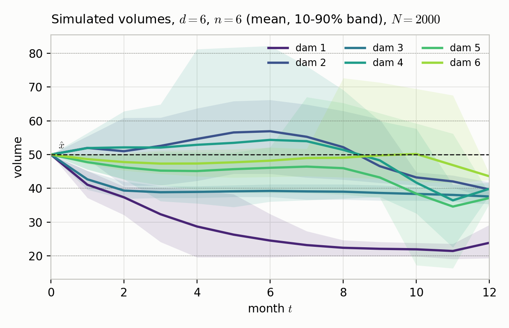
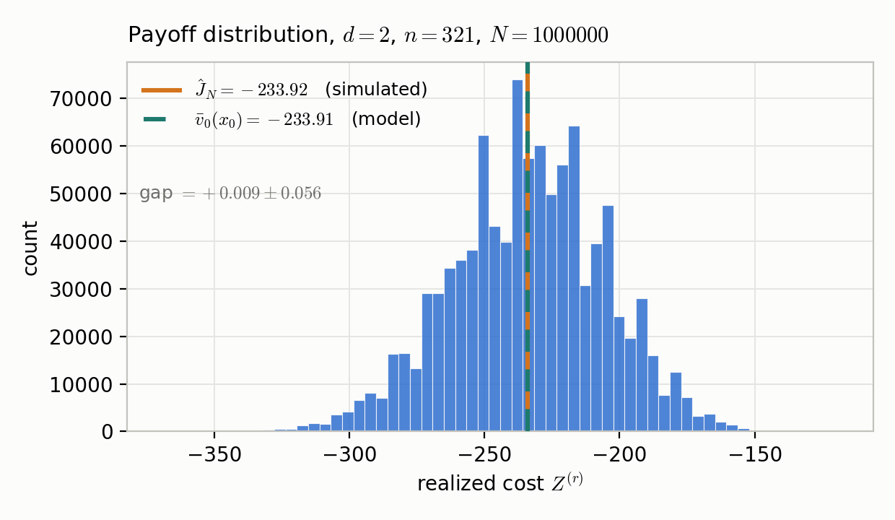
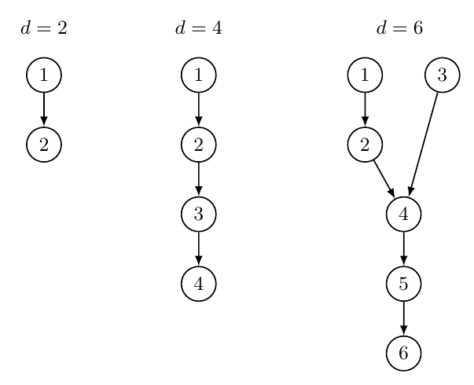

# Numerical results: finite-horizon DP for hydro reservoirs

Exact finite-horizon dynamic programming on a discretized state space, for a
valley of 2, 4 or 6 hydroelectric dams. Implementation of *Finite Horizon
Dynamic Programming for Hydro Reservoirs* (C. Won, M2 Optimization, IP Paris),
following Carpentier, Chancelier, Leclère and Pacaud, *Stochastic decomposition
applied to large-scale hydro valleys management*, EJOR 270(3):1086–1098, 2018.

The paper is in this repository as `paper.pdf` and on ResearchGate at
[doi:10.13140/RG.2.2.29841.80482](https://doi.org/10.13140/RG.2.2.29841.80482).
Equation and section numbers in the code comments, such as (23) or Section
III-C1, refer to it.

```
hydro.py         Algorithms 1 to 3 of the paper, vectorised
instances.py     the 2, 4 and 6 dam valleys
tests.py         regression tests against the paper's hand computations
experiments.py   E1 to E5
run_all.py       driver
analysis.py      diagnostics used while writing Section IV
```

## Results

Multilinear interpolation reaches on 121 grid points the accuracy that
nearest-neighbour rounding reaches only on 103,041, a factor of 852 in the size
of the state space and so in the running time. It also errs on the safe side:
its value function under-states what its own strategy earns, where rounding
over-states it on every grid tested.

| `n` | `delta` | interpolation error | ± | rounding error | ± |
|---|---|---|---|---|---|
| 6 | 20.000 | 2.976 | 0.006 | 74.474 | 0.965 |
| 11 | 10.000 | 0.529 | 0.004 | 28.903 | 0.409 |
| 21 | 5.000 | 0.0247 | 0.002 | 5.053 | 0.124 |
| 41 | 2.500 | 0.0065 | 0.001 | 1.525 | 0.027 |
| 81 | 1.250 | 0.0088 | 0.002 | 0.976 | 0.015 |
| 161 | 0.625 | 0.0018 | 0.001 | 0.796 | 0.008 |
| 321 | 0.313 | 0.0007 | 0.0006 | 0.531 | 0.005 |
| 641 | 0.156 | 0.00004 | 0.0003 | 0.222 | 0.006 |

Table II of the paper: two dams, `m = 10`, the same 10,000 scenarios in every
row, each rule measured against its own reference at `n = 1281`.



Six dams over one year. The policy empties dam 1 first, since water released
there is sold again at every dam below it, fills through the wet months and
draws down through the autumn. The mean paths sit on the grid points, which is
what six volumes per dam costs.



The realized cost of one year under the computed strategy, over a million
scenarios. The discretization error on this grid is 0.009 against a standard
deviation of 28.52, so the two marks coincide: what an operator does not know
about next year is the weather and not the mesh.

## How to run

```bash
python3 -m venv .venv && source .venv/bin/activate
pip install numpy matplotlib

python run_all.py --calibrate      # measure this machine, predict every run
python run_all.py --tests          # must pass before anything else
python run_all.py --all --heavy    # everything reported in the paper
```

`--all --heavy` produced the published numbers and takes about four and a half
hours on the machine below. Without `--heavy` the largest six-dam run is
skipped.

| experiment | output | in the paper |
|---|---|---|
| E1 | `results/e1_interpolation_vs_rounding.csv` | Tables II and III |
| E2 | `results/e2a_fixed_resolution.csv`, `e2b_finest_affordable.csv` | Table IV |
| E3 | `results/e3_estimator.csv` | Table V |
| E5 | `results/e5_dimension_at_fixed_resolution.csv` | Table VI |
| E4 | `figures/*.pdf` | Figures 2 and 3 |

All cores are used by default; `--workers N` sets the process count and
`--workers 1` runs serially. Backward passes are cached in `cache/`, so
re-running is cheap. Delete `cache/` after changing `instances.py`, since the
cache key is only `(d, n, m, rule)`. Cost scales as `(2nm)^d`, so doubling both
`n` and `m` costs a factor of `4^d`, which at `d = 6` is 4096.

## Correctness

| test | what it checks |
|---|---|
| `test_worked_example` | Section III-A by hand: `Eval` returns `-46.25`, the target point is `(60,20)`, and at the empty state under the dry noise the only admissible control is `(0,0)` |
| `test_one_dam` | the one-dam study: `V2 = (25,0,0)`, `V1 = (10,-30,-40)`, `V0 = (-8,-54,-76)`, `J = -62` by exhaustive enumeration |
| `test_interpolation_identities` | equations (22) and (23): the weights sum to one and reproduce the target point in expectation |
| `test_parallel_matches_serial` | parallel reproduces serial bit for bit, at `d = 2, 4, 6` and under both rules |
| `test_simulate_blocking` | chunked simulation reproduces unchunked bit for bit, and every volume stays inside `[0, xmax]` |

## The instance

Carpentier et al. publish no instance data for their academic valleys. They
state only that the dams have roughly equal maximal volume, that turbine
capacity grows and inflow falls with depth, that the inflow laws are discrete
with finite support, and that prices are deterministic. Only the topologies are
reproduced, from their Fig. 4:



An arrow from `j` to `i` means that dam `j` flows into dam `i`. The sets
themselves are `TOPOLOGY` in `instances.py`.

Every number is ours, and each respects one of their sentences:

| quantity | value |
|---|---|
| `T` | 12 monthly steps, one year |
| `xmax` | 100, all dams |
| local mean inflow | 8 at a source down to 3 at the outlet, linear in depth |
| `umax` | `round(2 x C)`, `C` the mean inflow of the dam's catchment |
| inflow law | `L = 5` outcomes, outcome `l` scaling every dam's mean inflow by `nu_l`, `nu = (0.4, 0.7, 1.0, 1.4, 2.0)`, with month-dependent probabilities |
| prices | deterministic, 1.3 at a source falling to 0.7 at the outlet |
| `eps` | `1e-3` |
| `xhat`, `x0` | 50, half full |
| `alpha` | 0.1 |

One multiplier scales all dams at once, so the valley is wet or dry as a whole.
Independent outcomes per dam would need `L = 5^d`, that is 15,625 at `d = 6`,
multiplying every runtime by 3125.

**Why `umax` follows the catchment and not the depth.** A dam must pass the
accumulated flow of everything above it. A naive ramp from 20 upstream to 40
downstream leaves the six-dam valley receiving 71.5 units a month at the bottom
and able to discharge 40, so it overflows whatever the policy does. The
multiplier was set by measurement: at `d = 4`, the share of releases that come
out exactly at the turbine limit, where the limit rather than the economics
decides the release, is

| multiplier | 1.0 | 1.2 | 1.4 | 1.6 | 2.0 | 3.0 |
|---|---|---|---|---|---|---|
| at the limit | 97.6% | 89.8% | 75.7% | 56.9% | 18.1% | 1.0% |

At 1.0 the turbine decides almost everything and the problem is not a dynamic
one; at 3.0 the limit is never reached and might as well not exist. 2.0 is the
smallest value that leaves the limit active in a minority of decisions.

**Seasonality is carried by the probabilities.** Section III-A3 requires the
support `W` to be the same every month, so the five inflow vectors are fixed and
their probabilities interpolate between a dry and a wet law over the year,
peaking in May. For the same reason prices are constant in `t`. The profile is
arbitrary and no conclusion depends on its shape.

**Spill is rare here.** With all capacities at 100 and a one-year horizon, a
reservoir overflows only once it holds less than about a month of catchment
flow. At `d = 4`, a reservoir of 4.1 months of flow overflows in 0.0% of
(month, scenario, dam) triples, 1.3 months in 0.1%, 0.8 months in 0.8%. The
`max` of (2) is dormant in the reported runs and is exercised by
`test_one_dam`, where the reservoir does overflow.

## Implementation notes

Points that belong to the code rather than to the mathematics.

* **Parallelism.** At fixed `t` every call to `Eval` reads the same array
  `V_{t+1}` and writes one entry of `V_t`, so the loop is embarrassingly
  parallel. `V_{t+1}` goes in a shared memory segment the workers map once.
  NumPy does not help by itself: it multi-threads only inside BLAS, and this is
  elementwise arithmetic, gathers and reductions. `HYDRO_MEM_MB` (default 256)
  caps the working set per worker.
* **Blocking.** Arrays indexed by (grid point, candidate, dam) hold
  `n^d x m^d x d` entries, beyond memory for all but the smallest valleys, so
  `backward` works on blocks of grid points and `simulate` on blocks of
  scenarios. Entries are independent, so neither result depends on the
  partition.
* **Minimisation over `U`.** `Eval` returns `+inf` at inadmissible candidates,
  so the minimum over the control grid equals the minimum over the admissible
  set. This is equation (54) of the paper.
* **The cell index is clipped from below.** The vectorised form evaluates every
  candidate before masking the inadmissible ones, so the floor of (16) can go
  negative and read entries of `V` belonging to no cell. Clipping into
  `[0, n-2]` handles it and leaves admissible candidates untouched.
* **The admissibility tolerance.** The code tests `u <= avail + 1e-9`, because
  the two sides are computed by different routes and a release that is legal in
  exact arithmetic can land a few bits above the bound. Measured at three
  configurations, the slack admits 0.001% to 0.033% of candidates, none of them
  ever the minimiser, and removing it reproduces every `V_t` bit for bit.
* **Algorithm 3 does not clip the stored state.** A clip would repair a state
  that had left the feasible set and leave no trace; `test_simulate_blocking`
  asserts the bound instead.
* **Tie-breaking and common random numbers.** `np.argmin` returns the first
  minimiser, which is the rule fixed in Section III-C1, and `draw_scenarios` is
  seeded, so differences between rows of a table are differences between
  policies rather than sampling noise.

## Machine

Our machine: Apple M4 Pro, 14 cores (10 performance and 4 efficiency), 24 GB, macOS 26.6.2,
Python 3.9.6, NumPy 2.0.2. 

Carpentier et al. report their timings on a 3.4 GHz four-core Intel Xeon E3, so absolute times are not comparable between the two papers; the growth in the number of dams is.

## Citation

```bibtex
@techreport{won2026hydro,
  author      = {Won, Christopher},
  title       = {Finite Horizon Dynamic Programming for Hydro Reservoirs},
  institution = {École polytechnique, Université Paris-Saclay},
  type        = {Technical Report},
  year        = {2026},
  month       = {10},
  doi         = {10.13140/RG.2.2.29841.80482}
}
```
